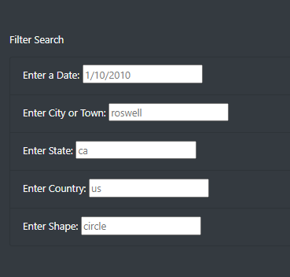
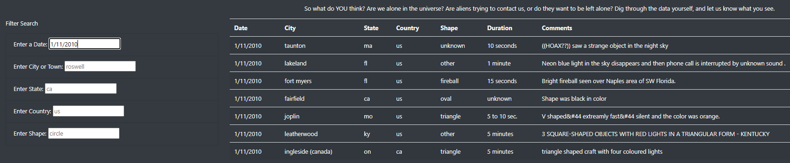
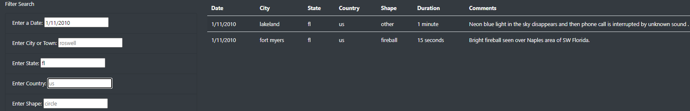
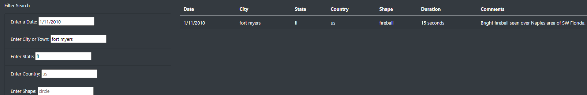

# UFO Sightings
## Overview of Project
The purpose of this project was to build a webpage that allows users to sort through a table of UFO sightings using various filters. While it was important to create a functional website, it had to look presentable as well.

## Results
There are five elements along the left side of the webpage, and data, that allows the users to refine the data. The filters, as seen below, are date, city, state, country, shape.

To perfrom a search, the user inputs what they want to search within one of the five filters.

After entering the data the table will return the data that matches the text that was entered into the filter.
If the user desires to refine the search even more, multiple filters can be used at once to provide a more specific result.

## Summary
One potential drawback with the design of this webpage is that it requires the users to be specific and exact with their searches to yield any results. Misspellings will lead to no results. 

Recommendations
1. Create a clear button to reset the filters. Currently the user has to manually delete all of their entries or refresh the webpage to reset the filters.
2. Allow for partial searchs to return results. For example, if a user is not sure of a town to enter so they wish to find towns that begin with the letter "C". Currently that would return no results instead of returning all the cities that start with the letter "C".
